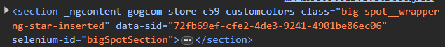

## Author Details

* Name: Gabriele Speciale
* Date: 2024-06-08
* Concat: gabriele.speciale@edu.itspiemonte.it


## Description
● Go to www.gog.com

● Use the devtools to view the DOM and write Javascript in the console

● Use the DOM access methods to find the following:
    ○ Every image on the page
    ○ The main menu at the top of the page
    ○ All the news items under "News"
      The footer
    ○ All the social media links at the bottom of the page

● Produce a readme.md file with
    ○ snippets of your Javascript code 
    ○ explanations of what which elements they select


# Solution 

## Every image on the page
```
let allImage = document.querySelectorAll("img.ng-star-inserted"); 
```

* Will return one NodeList through -> document.querySelectorAll("")

* We assign at one variable an NodeList, which consists of elements that correspond to this specified selector -> ("img.ng-star-inserted")

* OUTPUT:<br> 


## The main menu at the top of the page
```
let menuTopPage = document.getElementsByTagName("nav");
```

* will return one HTMLCollection through -> document.getElementsByTagName("")

* We assign at one variable an HTMLCollection, which consists of elements that correspond to the name of the specified tag -> ("nav")

* OUTPUT:<br> 


## All the news items under "News"
```
let newsItem = document.querySelector("section.ng-star-inserted");
```

* will return a single value, the first value whit the selector specified through -> document.querySelector("");

* We assign at one variable the return value, which consists of elements that correspond at the specified selecotor -> ("section.ng-star-inserted")

* OUTPUT:<br> 



## The footer
```
let footerPage = document.querySelector("footer.footer-microservice.main-footer");
```

* will return a single value, the first value whit the selector specified through -> document.querySelector("");

* We assign at one variable the return value, which consists of elements that correspond at the specified selecotor -> ("footer.footer-microservice.main-footer")

* OUTPUT:<br>


## All the social media links at the bottom of the page
```
let mediasFooter = document.querySelector("div.footer-microservice-socials");
```

* will return a single value, the first value whit the selector specified through -> document.querySelector("");

* We assign at one variable the return value, which consists of elements that correspond at the specified selecotor -> ("div.footer-microservice-socials")

* OUTPUT:<br> 
