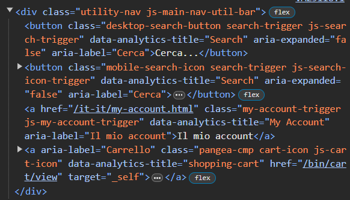
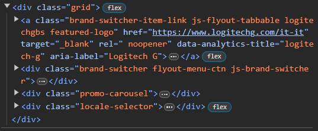
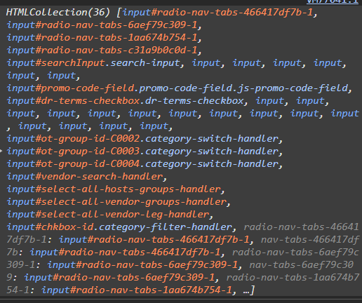
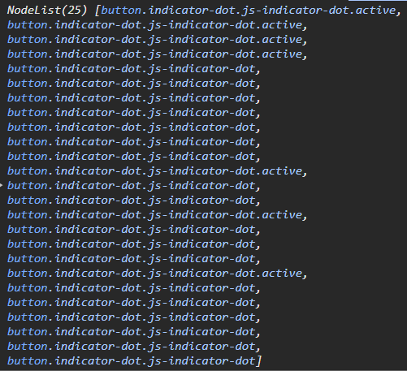
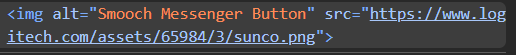
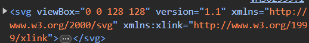
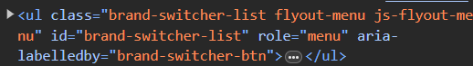
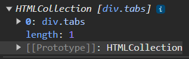

## Author Details

* Name: Gabriele Speciale
* Date: 2024-06-08
* Concat: gabriele.speciale@edu.itspiemonte.it


## Description

● Choose a news website that you like

● Use the devtools to view the DOM and write Javascript in the console

● Use the DOM access methods to find:
    ○ At least 10 different elements or collections of elements in the page
    ○ Choose interesting elements that require complex selectors to reach

● Produce a readme.md file with
    ○ A link to the website that you chose
    ○ snippets of your Javascript code 
    ○ explanations of what which elements they select


# Solution link page --> https://www.logitech.com/it-it

## 1 snippet
```
let utilityNavbar = document.querySelector("div.utility-nav");
```

* We assign to the variable the first element that corresponds to the selector --> "div.utility-nav"

* In this case, it will go to take the DIV which contains the fatigue lens and the cart in the Navbar

* OUTPUT:<br> 



## 2 snippet
```
let evidencedProducts = document.querySelector("div.grid"); console.log(evidencedProducts);
```
* We assign to the variable the first element that corresponds to the selector --> "div.grid"

* In this case, it will select the container showing the highlighted products of the logitech

* OUTPUT:<br> 



## 3 snippet
```
let inputs = document.getElementsByTagName("input");
```
* we assign to the variable an HTMLCollection of all elements that have the name of the tag --> "input"

* In this case, will take all the inputs around the home page

* OUTPUT:<br> 



## 4 snippet
```
let buttonsBalls = document.querySelectorAll("div button.indicator-dot.js-indicator-dot");
```
* we assign to the variable an NodeList of all elements that corresponds to the specified selector --> "div button.indicator-dot.js-indicator-dot"

* In this case, will take all the dots which are clickable buttons

* OUTPUT:<br> 



## 5 snippet
```
let messageIcon = document.querySelector("img[alt='Smooch Messenger Button']");
```
* We assign to the variable the first element that corresponds to the selector --> "img[alt='Smooch Messenger Button']"

* In this case, will take the image (icon) of the message clouds, in the bottom right of the footer

* OUTPUT:<br> 



## 6 snippet
```
let arrowRight = document.querySelector("svg[viewBox$='128']"); 
```
* We assign to the variable the first element that corresponds to the selector --> "svg[viewBox$='128']"

* In this case, will take the svg image which is an arrow that allows to change images on click

* OUTPUT:<br> 



## 7 snippet
```
let hiddenNav = document.getElementById("brand-switcher-list");
```
*  We assign to the variable the first element that corresponds at that ID --> "brand-switcher-list"

* In this case, Let's go to take the hidden navBar that opens only if we click the hamburger in the upper left of the main navBar
* OUTPUT:<br> 



## 8 snippet
```
let tabs = document.getElementsByClassName("tabs");
```
* we assign to the variable an HTMLCollection of all elements that corresponds to the specified class --> "tabs"

* In this case, is an tab containing differents section of products

* OUTPUT:<br> 
